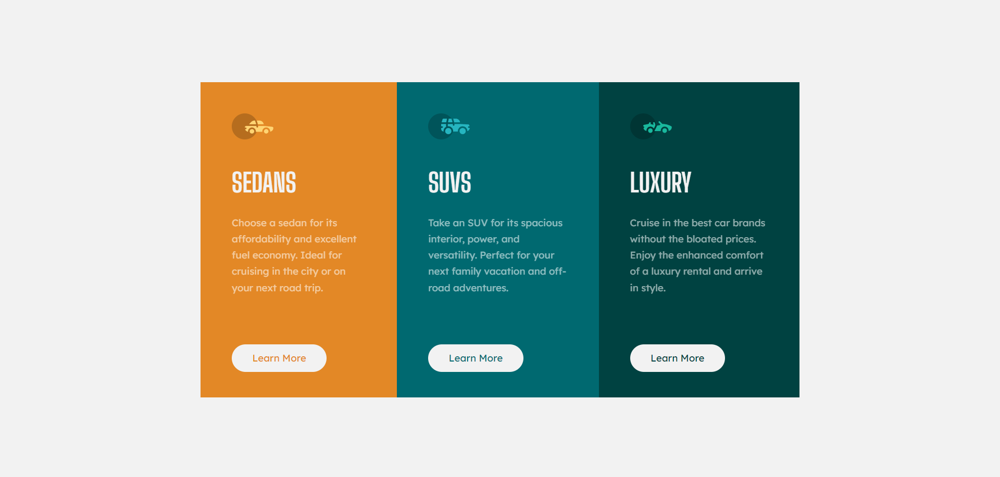

# Frontend Mentor - 3-column preview card component solution

This is a solution to the [3-column preview card component challenge on Frontend Mentor](https://www.frontendmentor.io/challenges/3column-preview-card-component-pH92eAR2-). Frontend Mentor challenges help you improve your coding skills by building realistic projects.

## Table of contents

- [Overview](#overview)
  - [Screenshot](#screenshot)
  - [Links](#links)
  - [Built with](#built-with)
- [Author](#author)

## Overview

It is project help me practice how use Flexbox, make animation for buttons, and how write more clean code.

### Screenshot

### Links

- Solution URL: [GitHub Repo](https://github.com/turkan03/3-column-previw-card.git)
- Live Site URL: [GitHub Pages](https://turkan03.github.io/3-column-previw-card/)
  ]

### Built with

- Semantic HTML5 markup
- Flexbox
- BEM

## Author

- Frontend Mentor - [@turkan03](https://www.frontendmentor.io/profile/turkan03)
